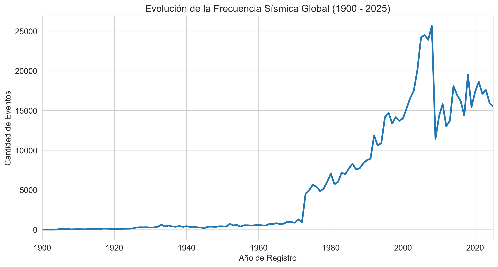
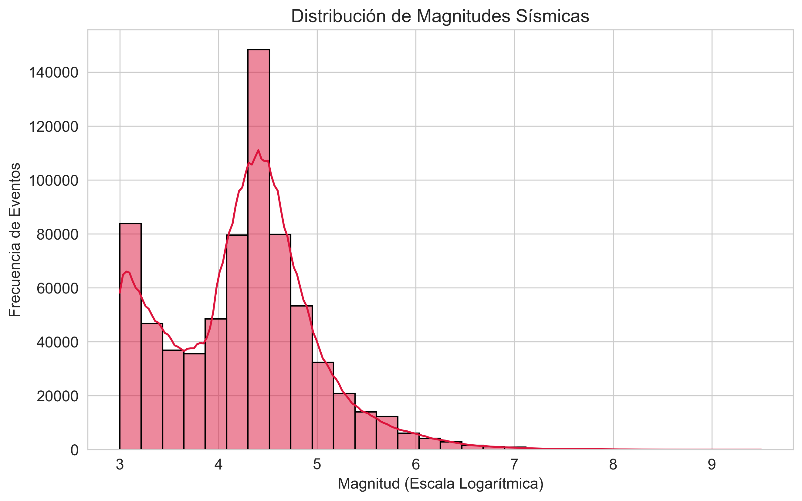
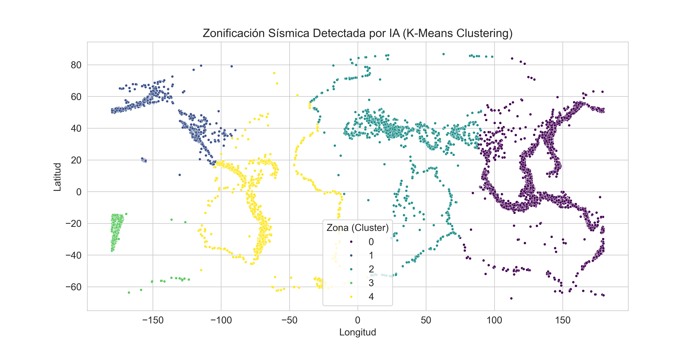
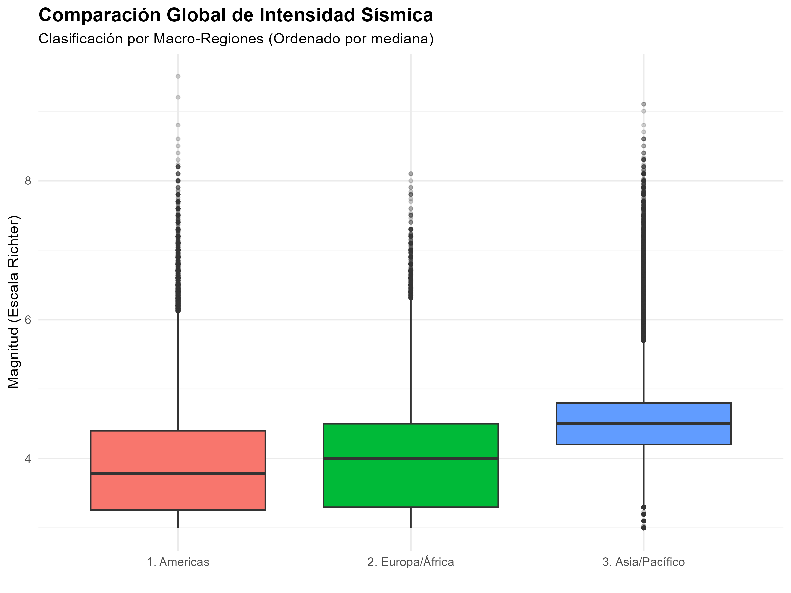
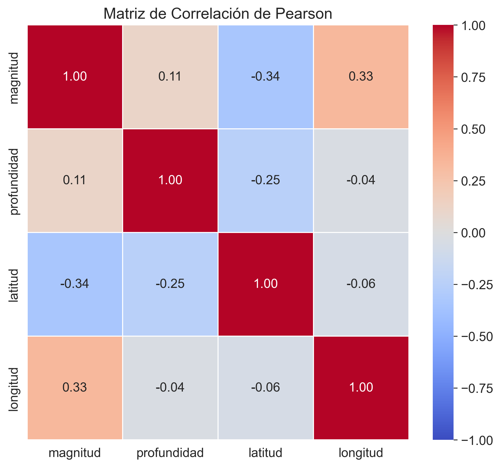
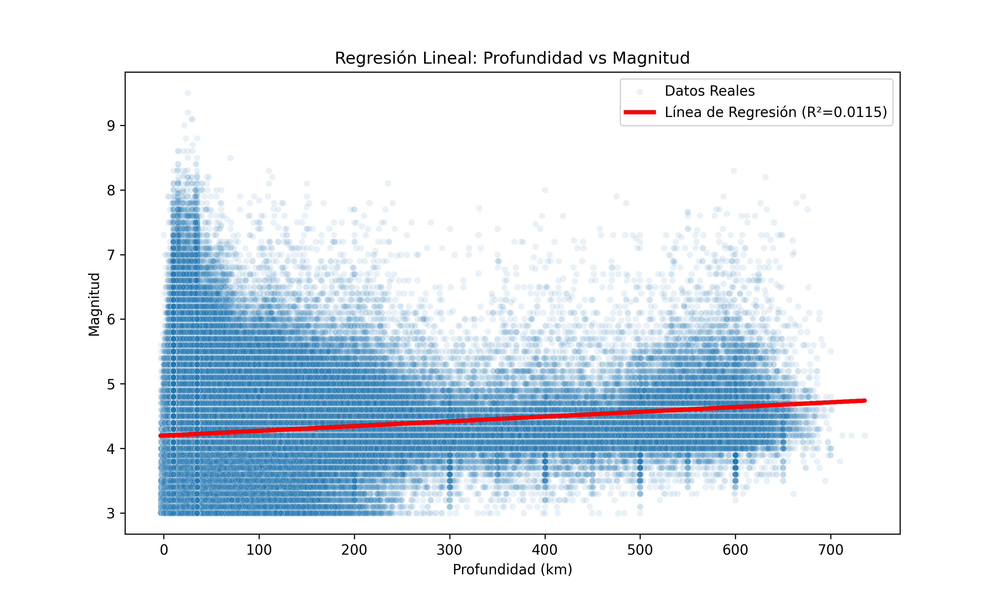

# Analítica de Datos Sísmicos Globales (1900–2025)

Análisis exploratorio y modelamiento de más de **4,3 millones de registros sísmicos** del catálogo del USGS (United States Geological Survey), usando Python (pandas, seaborn, scikit-learn) y R.

## Objetivos

- Procesar un dataset de ~2 GB sin agotar la memoria RAM.
- Limpiar y filtrar los datos para quedarse solo con terremotos relevantes.
- Describir cómo ha cambiado la frecuencia de sismos en el tiempo y cómo se distribuyen sus magnitudes.
- Agrupar los sismos en zonas geográficas con un modelo no supervisado (K-Means).
- Evaluar si la profundidad sirve para predecir la magnitud (regresión lineal).

## Resultados principales

| Etapa | Resultado |
|---|---|
| Registros brutos leídos | 4.358.464 |
| Sismos útiles tras la limpieza (magnitud ≥ 3.0, tipo `earthquake`) | 708.734 (83,7 % de los registros descartados) |
| Regresión lineal profundidad → magnitud | R² = 0,0115 |

- **Tendencia temporal:** la cantidad de sismos registrados crece fuertemente en las últimas décadas. Esto refleja sobre todo la mejora de la red de sismógrafos, no necesariamente un aumento real de la actividad.
- **Distribución de magnitudes:** los sismos leves son mucho más frecuentes que los grandes, como predice la ley de Gutenberg-Richter.
- **Correlaciones:** la profundidad y la magnitud prácticamente no están correlacionadas.
- **Clustering (K-Means, k = 5):** a partir solo de latitud y longitud, el modelo forma zonas que coinciden a grandes rasgos con las regiones más activas, como el Cinturón de Fuego del Pacífico.
- **Regresión:** con un R² cercano a 0, la profundidad por sí sola **no** permite predecir la magnitud de un sismo.
- **Comparación regional (R):** la región Asia/Pacífico tiene una mediana de magnitud mayor que América y Europa/África. Se comparó con un ANOVA.

### 🗺️ [Ver el mapa interactivo de sismos de magnitud ≥ 5.5](https://gustavoespi27.github.io/Proyecto_Sismos/Mapa_Final_SinRepeticion.html)

## Visualizaciones

| | |
|---|---|
|  |  |
|  |  |
|  |  |

## Metodología

1. **Lectura por bloques (chunking):** el CSV se lee de a 100.000 filas con `pd.read_csv(chunksize=...)`, así se puede procesar un archivo de 2 GB en un equipo común.
2. **Limpieza:** se eliminan filas con valores nulos en las variables críticas, se convierte la magnitud a número, se descartan eventos que no son terremotos (explosiones, canteras) y microsismos (magnitud < 3.0), y se normalizan las fechas.
3. **Visualización:** gráficos de tendencia temporal, histograma de magnitudes y matriz de correlación de Pearson.
4. **Modelamiento:** K-Means sobre una muestra de 10.000 sismos y regresión lineal con separación entrenamiento/prueba 80/20.
5. **Análisis en R:** mapa interactivo con Leaflet, boxplot por macro-región con ANOVA y ranking de países (con más o menos sismos y con mayor o menor magnitud promedio) a partir del texto del campo `lugar`.

## Estructura del repositorio

```
├── analisis_python.ipynb            # Python: limpieza, gráficos, clustering y regresión
├── Analisis_Sismo.R                 # R: mapa interactivo, comparación regional (ANOVA) y ranking de países
├── Grafico_*.png                    # Gráficos generados
├── Mapa_Final_SinRepeticion.html    # Mapa interactivo (Leaflet)
├── requirements.txt                 # Dependencias de Python
└── README.md
```

## Cómo ejecutarlo

1. Descarga el catálogo de sismos del USGS desde el [Earthquake Catalog](https://earthquake.usgs.gov/earthquakes/search/) y guárdalo como `Earthquakes_USGS.csv` en la raíz del proyecto. Los datos no se incluyen en el repositorio por su tamaño (~2 GB).
2. Instala las dependencias:
   ```bash
   pip install -r requirements.txt
   ```
3. Abre `analisis_python.ipynb` y ejecuta las celdas en orden. La celda de limpieza genera `sismos_procesados.csv`, que usan las celdas siguientes.
4. (Opcional) En R, instala los paquetes `tidyverse`, `leaflet`, `htmlwidgets` y `gridExtra`, y ejecuta `Analisis_Sismo.R` desde la carpeta del proyecto.

## Limitaciones

- El catálogo mezcla distintos tipos de magnitud (ML, mb, Mw, etc.) y aquí se analizan como una sola escala.
- El aumento de registros en el tiempo está influido por la mejora de la red de detección.
- Con ~700 mil registros, el ANOVA detecta como significativas incluso diferencias pequeñas; conviene mirar también el tamaño del efecto.
- Las macro-regiones se definen solo por longitud, así que son una aproximación gruesa.
- K-Means usa la latitud y la longitud como coordenadas planas, sin considerar que el mapa se "cierra" en la longitud ±180°.

## Tecnologías

Python · pandas · matplotlib · seaborn · scikit-learn · Jupyter · R (tidyverse, ggplot2, leaflet)

## Autor

**Gustavo Espinoza** · [GitHub](https://github.com/gustavoespi27)
